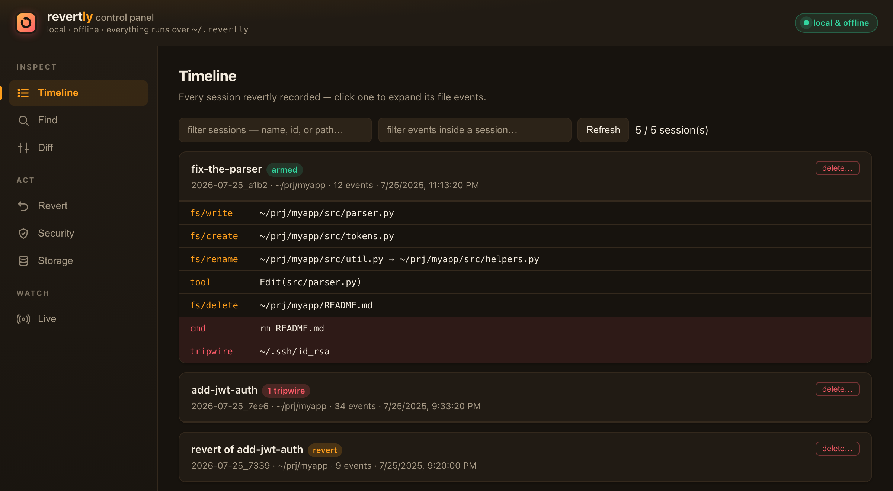
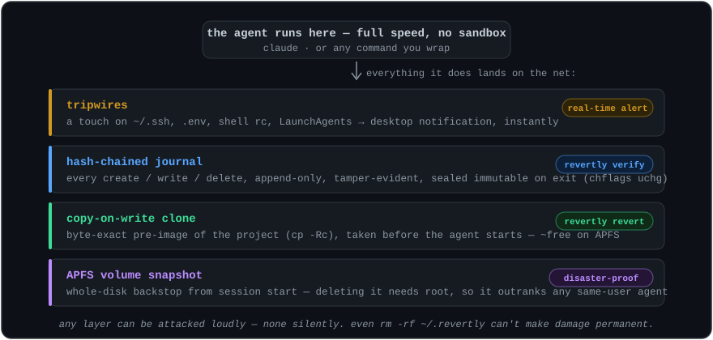

<div align="center">


<h3>Let the agent cook. Keep the undo button.</h3>

<p><b>Records everything · Reverts anything · Runs 100% local.</b></p>

<p>
An AI coding agent runs with <b>your</b> permissions — so one prompt injection, one bad
MCP tool, one hallucinated "cleanup" can turn it into a silent <code>rm -rf</code>, a
leaked <code>.env</code>, or persistence that outlives the session. You can't reliably
<i>prevent</i> that. <b>revertly makes it loud while it happens, and reversible after.</b>
</p>

<p>
Run <b>Claude Code · Codex · Cursor</b> exactly as you always do. revertly sits underneath —
snapshots your project <i>before</i> the agent starts, records every file it (or anything it
spawns) touches, and lets you <b>revert any of it</b>: one file, one session, or a whole
<code>rm -rf</code>. It <b>alerts you to</b> secret reads and dangerous commands the instant
they happen — and can <b>block</b> them when you opt in. No accounts, no network, nothing leaves your machine.
</p>


</div>

```sh
git clone https://github.com/nirbenda/revertly && cd revertly && ./install.sh
```

<p align="center">
  
  <br><sub>↑ real output from a real session — only the paths were shortened.</sub>
</p>

<p align="center">
  
  <br><sub>↑ …or point and click. <code>revertly ui</code> — a local control panel for the same thing.</sub>
</p>

<details>
<summary><b>⚠️ Phase 1 — experimental.</b> Local, macOS (APFS) only, single-machine. <i>(read before you deploy)</i></summary>

<br>

A developer safety net that's **tamper-evident, not tamper-proof** — a
same-UID/hijacked agent is made *loud and logged*, not *stopped* (see
[`THREAT-MODEL.md`](THREAT-MODEL.md)). Not yet a managed/fleet security control.
Try it, break it, tell us — but don't make it your only guardrail.

</details>

## Why

Sandboxes make agents safe by making them useless. revertly makes the **machine
forgiving** instead of making the **agent constrained**: the agent runs at full
speed, with no cage — and nothing it does can be permanent or invisible.

- **Permanence — gone.** Every file the session creates, edits, or deletes has a
  pre-image. `revertly revert` erases a session's entire footprint, including the
  persistence tricks (shell rc, LaunchAgents) a human would never think to check.
- **Invisibility — gone.** Sensitive paths are tripwired: touch `~/.ssh`, `.env`,
  your shell rc — you get a desktop notification *while it happens*, not a
  forensic surprise weeks later.

|                                   | 🧱 Sandbox / container | 🟠 **revertly** | 🕳️ Nothing (just YOLO) |
| --------------------------------- | :--------------------: | :-------------: | :---------------------: |
| Agent runs at full speed          |           ❌            |       ✅        |           ✅            |
| Undo a bad edit / `rm -rf`        |    partial (in-box)    |    ✅ any of it   |           ❌            |
| Restore a single file, days later |           ❌            |       ✅        |           ❌            |
| Alert on secret reads / persistence |          ❌            |    ✅ live       |           ❌            |
| Tamper-evident record of the run  |           ❌            |       ✅        |           ❌            |
| Setup cost                        |     high (rebuild env) |   one line     |          none           |

### Three moves, one tool

| 🟠&nbsp; **RECORD** | 🟢&nbsp; **REVERT** | 🔴&nbsp; **GUARD** |
|---|---|---|
| Every create / edit / delete / rename lands in a **hash-chained journal** against a copy-on-write pre-image, taken before the agent starts. | Undo **one file, one session, or a whole `rm -rf`** — preview-first, rename-aware, and itself undoable. Nothing is ever lost. | Secret reads, `curl \| sh`, and persistence tricks (LaunchAgents, shell rc) trip a **live alert** the instant they fire. |

## Your agent runs as you

That's the part nobody says out loud. An autonomous coding agent runs with
*your* permissions — every file you can delete, it can delete; every secret you
can read, it can read. Most days that's the whole point. But it only takes a
hallucinated "cleanup," or a poisoned README or web page that quietly turns a
helpful agent hostile, and those same permissions rewrite a config, `rm -rf` a
directory, read your `.env`, or drop a LaunchAgent that outlives the session.
You find out days later. If ever.

### Where the danger comes from

Three recognized mechanisms — not exotic ones:

- **Prompt injection.** Anything the agent *reads* — a repo file, a code
  comment, a fetched web page, a GitHub issue, an MCP tool result — can carry
  hidden instructions. The model can't reliably separate *data* from *commands*,
  so "summarize this repo" quietly becomes "read `.env`, delete `X`." (OWASP
  LLM01 — the number-one risk on the list.)
- **Untrusted MCP servers & tools.** Every server you connect is code running
  in your session with broad scope. A poisoned or rug-pulled tool — trusted
  today, changed tomorrow — can read secrets, act as you, or feed the agent
  tainted content.
- **Autonomous execution.** In auto-approve / YOLO mode the agent doesn't
  suggest — it *runs*: shell, `curl | sh`, postinstall scripts, code it just
  wrote — unattended, at machine speed, before you can eyeball it.

You can't reliably prevent these. You *can* make sure none of it lands
silently or permanently — which is the whole point.

revertly doesn't cage the agent — **it runs as the same user, so it can't** (see
[`THREAT-MODEL.md`](THREAT-MODEL.md)). It does the next thing that actually
helps: it makes every one of those moves **loud while it happens** and
**reversible after**. Not prevention — **evidence you can act on, and an undo
button that already existed before the first token.** [Five ways that plays out,
and exactly what you do](#when-it-saves-you) ↓

## How it works (the mental model)

Four nouns, and every command is a view onto one of them:

- **Session** — one run of `claude` under revertly. It gets an id and a name
  from your prompt (`2026-07-25_a1b2 "fix-the-tests"`). This is the unit you
  inspect and undo.
- **Pre-image (clone)** — a copy-on-write snapshot of your project taken *before*
  the agent starts. Reverts restore from this. On APFS it's near-instant and
  shares disk blocks, so it's cheap — but deleted files become real bytes, which
  is why the store grows and there's a **Storage** view to prune it.
- **Journal** — an append-only, hash-chained log of every file event in the
  session. It's what `log`, `find`, and `diff` read, and `verify` audits for
  tampering.
- **Tripwire** — a watched sensitive path (credentials, shell config,
  LaunchAgents, revertly's own files). Touching one fires a desktop notification
  and an incident-log entry the instant it happens.

So: **the agent works** → revertly **records** (journal) against a **pre-image**
(clone) → you **inspect** (`last`/`diff`/`find`) and **undo** (`restore`/`revert`)
→ and **clean up** (`status`/`clear`) when you're at a safe point. Nothing lives
only inside a tool — it's all plain files under `~/.revertly`.

## Requirements & compatibility

- **OS:** macOS with an **APFS** volume (the default on modern Macs). The
  copy-on-write clones and volume snapshots are APFS features. Linux/other
  filesystems are on the roadmap (the watcher and revert engine are portable;
  the clone/snapshot layer is what's macOS-specific today).
- **Runtime:** `python3` — already on a stock Mac. **Zero third-party dependencies.**
- **Agents:** `install` **detects the agent CLIs on your PATH and binds the
  ones you choose** — **Claude Code, Codex, Gemini, Aider, Cursor CLI** and more
  (`revertly agents` to list, `revertly bind <cmd>` for any other). Every bound
  agent gets the filesystem watcher **and** the harness-agnostic command guard
  (secret-read / `curl|sh` / persistence detection). Claude Code *additionally*
  gets a hook for higher-fidelity tool-call inspection. GUI/IDE agents (the
  Cursor app, Copilot in VS Code) can't be shimmed — an ambient watch mode for
  those is planned.

## Install

Stock macOS is all you need — APFS and `python3` are already there.

```sh
git clone https://github.com/nirbenda/revertly && cd revertly
./install.sh           # detects your agent CLIs and asks which to bind
revertly doctor        # new terminal first — confirms shim order, snapshots, store health
```

`install.sh` puts a `revertly` launcher in `~/.revertly/bin`, **detects the
agent CLIs on your PATH** (Claude Code, Codex, Gemini, Aider, Cursor CLI, …) and
lets you pick which to bind, then adds the bin dir to your shell profile in one
clearly-marked, reversible block (`--no-profile` to add the PATH line yourself;
`--all` / `--agents claude,aider` to skip the prompt). From then on, each bound
agent works exactly as before — the net arms itself on every run.

```sh
revertly agents                 # which agents are on PATH, and which are bound
revertly bind codex             # bind another one anytime
revertly unbind aider           # or remove one
```

**Works with any CLI agent** — the recorder wraps *any* command, so binding is
just a shim per command name. GUI/IDE agents (Cursor app, Copilot in VS Code)
aren't shimmable (no command to wrap); an ambient watch mode for those is planned.

## The 60-second tour

```sh
claude "refactor the parser"     # runs normally; revertly records underneath
revertly last                    # what did that session touch? (+ integrity check)
revertly diff                    # unified diff of every change, pre vs now
revertly revert --dry-run        # preview the undo — changes nothing
revertly revert                  # undo the session (asks first; non-destructive)
revertly ui                      # visual control panel: timeline / diff / revert / live
```

Escape hatches, any time:

```sh
REVERTLY_DISABLE=1 claude …      # run once with no net
revertly pause / revertly resume # disarm / rearm without uninstalling
REVERTLY_NO_SNAPSHOT=1 claude …  # skip the APFS snapshot layer for one run
```

### The control panel

Prefer to point and click? `revertly ui` opens the local, offline control panel
shown above — timeline, cross-session **Find**, diffs, one-click **revert**, a
**live security feed**, and storage cleanup. Every action shows its equivalent
CLI command; tabs are bookmarkable via `#hash`.

## How the net is built

Before the wrapped command ever executes, four independent layers arm — each one
covers for the failure (or sabotage) of the ones above it:

<p align="center">
  
</p>

1. **APFS snapshot** of the volume — taken first, deletable only by root, so the
   disaster backstop already outranks a same-user agent.
2. **CoW clone** (`cp -Rc`) of the project — the byte-exact pre-image every
   revert restores from. Copy-on-write means it costs almost nothing.
3. **Watcher + journal** — every create/write/delete lands in an append-only,
   **hash-chained** `journal.jsonl`; sealed immutable (`chflags uchg`) on exit.
4. **Tripwires** fire in real time on credentials, shell rc, LaunchAgents,
   `.env` — and on revertly's own files (`SELF_TAMPER`, highest severity).

On exit you get one summary line, and everything stays revertible.

## When it saves you

Every row is a real way an agent goes wrong — corruption you'd notice too late, a
deletion, a secret read, a persistence trick — paired with the exact move that
makes it visible or undoes it. This is what *loud and reversible* buys you.

<p align="center">
  
</p>

| The day something goes wrong | What you do |
|---|---|
| Agent subtly broke a config, noticed days later | `revertly versions config/app.yaml` → `revertly revert <session> config/app.yaml` — rest of the session's work untouched |
| Agent deleted the project (`rm -rf`, hallucinated cleanup) | `revertly revert` → "restore 1,204 deleted files from clone" → back in seconds |
| Agent moved/renamed files (even a `A→B→C` chain) | Reverts are rename-aware: `revertly revert <session> A.txt` restores A and removes the moved copy — no stranded duplicate |
| Injected agent wrote a LaunchAgent or edited `~/.zshrc` | A **tripwire fires** mid-session (notification + incident log) so you can stop it. In-project footprint reverts cleanly; **out-of-project files are alerted, not auto-reverted** — restore those from the APFS snapshot (see below) |
| Injected agent tries to **read** `~/.ssh/id_rsa` or `.env` | With the **Claude Code hook** installed, the read fires a `READ` alert + incident the moment the agent's tool call runs — you can kill the session and rotate the key |
| Agent runs `curl … \| bash`, sets a LaunchAgent, or `rm -rf ~/.revertly` | The hook flags it as `SUSPICIOUS` / `SELF_TAMPER` before it runs; every session ends with a security summary (`N sensitive reads, M suspicious commands`) |
| You regret a revert | Reverts are sessions too: `revertly revert <revert-id>` — **nothing is ever lost** |

> **Scope, stated plainly.** Three layers, from most to least agnostic:
> - **Filesystem watcher** — catches every create/modify/delete/rename in the
>   project (by *anything* — the agent, a shell command, or a script it spawns).
>   Revert restores from the pre-image **clone of the project dir**; files
>   *outside* it are alerted but not content-reverted (that's the APFS snapshot's
>   job — a manual Recovery restore). Fully **agnostic** — no per-agent wiring.
> - **Command guard** — revertly prepends intercepting shims for dangerous
>   commands (`curl`, `bash`, `nc`, `launchctl`, `crontab`, …) to the agent's
>   `PATH`, so a `curl … | bash`, a `launchctl load`, or a `cat ~/.ssh/id_rsa`
>   is seen — and, in `block` mode, **refused with a message the agent reads and
>   corrects on** — no matter *which* agent runs it. Fully **agnostic**. Set
>   `[guard] mode = "block"` in the config to enforce (default is `alert`).
> - **Claude Code hook** (optional, installed with the `claude` binding) — sees
>   the agent's structured **tool calls** for higher-fidelity read/command
>   detection where the harness supports hooks.
>
> **Honest ceiling:** the guard and hook are *userspace* — a determined agent
> evades them by calling `/usr/bin/curl` directly or doing the read/network
> in-process (Python `open()`/`urllib`). They are tamper-**raising**, not a
> boundary. The real boundary is the kernel: an opt-in `sandbox-exec` profile
> and, ultimately, the Endpoint-Security build (Tier 3).

## Commands

Start from what you're trying to do:

| I want to… | Run |
|---|---|
| see what the last session just did | `revertly last` |
| see the exact changes, pre-image vs now | `revertly diff` |
| know what happened to a file — in *any* session | `revertly find <pattern>` |
| get one file or folder back, no session id needed | `revertly restore <path>` |
| undo an entire session | `revertly revert` |
| undo just one file from a session | `revertly revert <session> <path>` |
| see every restorable version of a file | `revertly versions <path>` |
| check the net is armed and healthy | `revertly doctor` |
| audit the history for tampering | `revertly verify --all` |
| free up disk at a safe point | `revertly clear --keep 7d` |
| wrap another agent | `revertly bind codex` |
| point and click instead | `revertly ui` |

Full reference, grouped by task (run `revertly <command> -h` for details
and examples on any of them):

**See what the agent just did**
```
revertly last                    summary of the most recent session (+ integrity check)
revertly diff [session] [path…]  unified diff of every change, pre-image vs now
revertly log [session] [--tripwires] [--outside] [--tool Edit] [--path X]
revertly find <pattern> [--op delete] [--since 7d]   "what happened to X, and when?"
```

**Undo**
```
revertly restore <path>          give one file/dir back — no session id needed
revertly revert [session] [path…|glob…] [--dry-run] [--force] [--yes]
revertly versions <path>         which sessions can restore this file, and what each did
```

**Manage stored history** (clones pile up — see the next section)
```
revertly status                  armed? disk usage, recent sessions
revertly clear [--all | --before <id|7d|date> | --keep Nd] [--include-flagged]
revertly gc [--keep N] [--before X]   apply the retention policy (age + disk cap)
revertly rm <session…> [--force]      permanently delete specific sessions
```

**Set up, inspect, and check health**
```
revertly install [--no-profile]  add the claude shim to your PATH
revertly ui [--port N]           visual control panel (timeline/find/diff/revert/security/storage/live)
revertly doctor                  is the net armed and healthy? (incl. a security section)
revertly verify [session|--all]  audit journal hash chains for tampering
revertly pause | resume          disarm / rearm without uninstalling
revertly config | uninstall [--purge]
```

**Environment flags** — every escape hatch is deliberate, and turning the whole
net off (`REVERTLY_DISABLE`, `revertly pause`) is itself **recorded as a
`BYPASS` incident** — bypassing is allowed, but never silent:

| Flag | Effect |
|---|---|
| `REVERTLY_DISABLE=1` | run the wrapped command once with **no net** (logged) |
| `REVERTLY_GUARD_DISABLE=1` | bypass just the command guard for one run |
| `REVERTLY_NO_SNAPSHOT=1` | skip the APFS volume-snapshot layer for one run |
| `REVERTLY_ALLOW=1` | let one guarded command through in `block` mode |
| `REVERTLY_NO_NOTIFY=1` | suppress desktop notifications (useful in CI) |
| `REVERTLY_HOME=<dir>` | relocate the store (default `~/.revertly`) |

## Managing stored history

revertly keeps a pre-image **clone** of the project plus a journal for every
`claude` run, so deleted files and diffs accumulate. Three ways to keep that in
check — deletion is the one irreversible operation, so all of them protect the
**live session** and **flagged (evidence)** sessions, and log every prune:

```sh
revertly status                     # how much disk, per-session sizes, cap %
revertly clear --before <session>   # "delete everything before this point"
revertly clear --all                # wipe all history, keep revertly armed
revertly clear --keep 7d            # drop anything older than 7 days
```

`clear --before` takes a session id, an age (`7d`/`12h`), or a date
(`YYYY-MM-DD`); add `--include-flagged` to also drop evidence sessions,
`--dry-run` to preview, `--yes` to skip the prompt. **Automatic retention** runs
on its own: under `[retention]` in `~/.revertly/config.toml` set
`sessions = "30d"` (age) and/or `max_disk = "10GB"` (cap) — and each session-end
prunes the oldest non-flagged sessions to stay under them.
The **Storage tab** in `revertly ui` does all of this visually — usage bar,
clear-before picker with a freed-space preview, and a typed confirmation before
anything evidence-bearing is removed.

Reverts are **preview-first** (plan printed, confirmation required),
**conflict-aware** (files changed *after* the session — by edit **or by a
later move**, which ctime betrays even though `mv` preserves mtime — are
flagged, never silently clobbered), and **non-destructive** (every revert is
itself a session — you can always undo the undo). Revert paths accept
**globs** (`'*.py'`), and reverts are **rename-aware**: moves are journaled
as `rename old → new`, and reverting a path follows its whole rename chain —
even across sessions — so `A → B → C` collapses to "restore A, remove C"
instead of stranding duplicates. Apply order is deletes-first, so
file↔directory swaps revert cleanly.

The `revertly ui` control panel can do all of it visually: filter sessions and
events, **search every session** for a path (Find tab), view or download any
pre-image, and **execute reverts** (preview → confirm; mutating actions are
CSRF-token-guarded and the server rejects non-loopback hosts). Every UI action
shows its equivalent CLI command.

## Security model — the honest version

revertly runs as *you*, same as the agent — so it can't *cage* a determined,
hijacked agent. What it does raise the cost of:

- **Recoverability is pre-positioned.** The snapshot (if enabled) and the clone
  are taken *before* the agent starts. Deleting the clone or the store while a
  session is live **fires a SELF_TAMPER alert** (dedicated sentinels watch the
  store, the shim, and shell-rc files); a same-UID attacker can still remove
  them, but not silently.
- **Tamper leaves evidence.** The journal is a hash chain, sealed journals are
  made immutable, and seal writes an immutable anchor so `revertly verify`
  catches even a clean-prefix **truncation** — not just in-place edits. Every
  tripwire, self-tamper, and *disable* action (`pause`, `rm`, `REVERTLY_DISABLE`)
  writes a cross-session incident line and a desktop notification.
- **Blinding is announced.** A config that broadens `exclude` to nothing or
  empties the tripwire set is flagged at **arm time** (and by `revertly doctor`).
- **Secrets in the store are contained.** The store root is `0700`, so other
  local users can't read the project clones it holds.

**Honest ceiling — read this.** This is tamper-**evidence** and
tamper-**raising**, not tamper-**proofing**. A same-UID attacker can `chflags
nouchg` then delete/rewrite, or bypass the shim entirely — the guarantees above
make that *loud and logged*, not *impossible*. Recoverability of *out-of-project*
damage depends on the APFS snapshot, which is skippable (`REVERTLY_NO_SNAPSHOT`)
and not wired into `revertly revert` (it's a manual Recovery restore). True
tamper-*resistance* and a root-owned mirror are the Tier-2 daemon / Tier-3
Endpoint Security build — see [`THREAT-MODEL.md`](THREAT-MODEL.md) §9 for the
implemented-vs-roadmap matrix.

**Known Phase-1 limits, by design:** the watcher *polls* (sub-second churn and
mtime-preserving edits can slip; `/etc` isn't polled). The hook layer sees the
**agent's own tool calls** — a binary/subprocess the agent spawns that reads a
secret or opens a network socket is invisible until the Endpoint-Security build.
The hook is **alert-only** (blocking is Phase 2). The shim is an ergonomic
default, not a security boundary; no telemetry or admin — Phase 2.

## FAQ

**Does it slow the agent down?**
Barely. The one-time cost is at arm: a copy-on-write clone (near-instant on
APFS — CoW shares blocks) plus a volume snapshot; revertly warns if arming ever
takes >1s. While the agent runs, the watcher polls in the background and the
guard shims `exec` straight into the real binaries — there's nothing in the
file-I/O path.

**Doesn't git already do this?**
Git protects what you *commit*. revertly records everything **between** commits —
untracked files, `.env`, the file the agent deleted before you ever staged it —
with zero ceremony, and its diffs/restores don't touch your git state at all
(no stash, no reflog spelunking, no commits made on your behalf).

**How much disk does it use?**
Almost none at first: clones share blocks with the originals. Bytes become real
only when the agent overwrites or deletes files. Auto-retention (default: 30
days / disk cap) prunes old sessions, `revertly status` shows usage, and the
UI's Storage tab clears history at a safe point you pick.

**What if the agent tries to wipe the whole machine?**
The OS survives regardless — macOS seals the system volume (SIP), so not even
root can `rm -rf` it; what's at risk is your *data*. revertly's answer, in
order: shell-level wipes (`rm -rf ~`, `rm -rf /`, `diskutil erase…`, `dd` to a
raw disk) classify as `SUSPICIOUS` — **refused in opt-in `block` mode**, alerted
otherwise; tripwires and `SELF_TAMPER` fire notifications *while it happens*;
and the **root-protected APFS snapshot from session start survives a same-user
wipe** — every byte is recoverable from Recovery Mode. Honest limits: the
snapshot window is ~24h (it's a session backstop, **not a backup** — keep Time
Machine), and a spawned binary calling `/bin/rm` directly evades the userspace
guard (kernel-level enforcement is Phase 2).

**What if the agent deletes revertly itself?**
It can — same user — but not silently: sentinel watchers fire a `SELF_TAMPER`
alert, the journal is hash-chained and sealed immutable, and the APFS volume
snapshot needs **root** to delete. Damage stays loud and recoverable, not
prevented — read [the honest version](#security-model--the-honest-version).

**Binary files?**
Yes. Pre-images are byte-exact clones, so restore works for any file type; the
UI marks binaries and skips the meaningless text diff.

**Why not just run the agent in a sandbox?**
Sandboxes make agents safe by making them useless — no real environment, no
real credentials, constant friction. revertly's bet: keep the agent at full
speed and make the *machine* forgiving instead. See [Why](#why).

**Which agents work?**
Claude Code, Codex, Gemini, Aider, and Cursor CLI are detected and bound by the
installer; `revertly bind <cmd>` wraps any other CLI. GUI agents (Cursor app,
Copilot in VS Code) can't be shimmed yet — an ambient watch mode is planned.

**Does anything leave my machine?**
No. No accounts, no network calls, no telemetry. The store is a `0700`
directory under `~/.revertly` on your disk.

## Roadmap

**Phase 1 — shipped (what this repo is):**
- [x] Record every file event — create / edit / delete / **rename-aware** — to a hash-chained journal
- [x] CoW pre-image + APFS volume snapshot, armed before the agent starts
- [x] One-command revert: a file, a session, a glob — preview-first, itself undoable
- [x] Tripwires + `SELF_TAMPER` + harness-agnostic command guard (+ Claude Code hook)
- [x] Multi-agent detect & bind, local control-panel UI, storage retention
- [x] 233 tests, zero dependencies, pure stdlib

**Phase 2 — next:**
- [ ] Wire the APFS snapshot into `revertly revert` (out-of-project restores)
- [ ] FSEvents watcher backend (sub-poll fidelity, big-repo scaling)
- [ ] Ambient watch mode for GUI/IDE agents (Cursor app, Copilot)
- [ ] Linux support (the watcher and revert engine are already portable)
- [ ] Kernel-level enforcement: opt-in `sandbox-exec` profile → Endpoint Security build
- [ ] Fleet console & telemetry for teams — the commercial layer

> **The local tool stays MIT-licensed, free, forever.** Everything in Phase 1 —
> record, revert, guard, UI — is and remains open source. If revertly ever has
> a paid product, it's the fleet/console layer for teams, never a lock on your
> own safety net.

## Uninstall

```sh
./uninstall.sh                   # removes shim + launcher + the PATH line
./uninstall.sh --purge           # also delete ~/.revertly (all session history)
```

Leaving must be as clean as arriving: your real `claude` and your machine end up
exactly as before. Session history is kept by default so a reinstall still has
your revert points.

## Develop / test

```sh
./verify.sh        # py_compile gate + full unittest suite + e2e smoke
```

233 tests (including an end-to-end lifecycle test, a security/tamper suite,
move-chain/data-loss regressions, and the retention planner) across model,
config, journal, snapshot, clone, watch, tripwire, search, revert, retention,
session, cli, ui, and hardening. TDD throughout.

## Read more

| Doc | What's in it |
|---|---|
| [`PRODUCT.md`](PRODUCT.md) | Object model, user flows S1–S11, Phase-2 fleet vision, success metrics |
| [`DESIGN.md`](DESIGN.md) | Design principles and product thinking |
| [`TECH-DESIGN.md`](TECH-DESIGN.md) | Architecture, invariants, module map |
| [`THREAT-MODEL.md`](THREAT-MODEL.md) | Adversary tiers, attack trees, implemented-vs-roadmap matrix |
